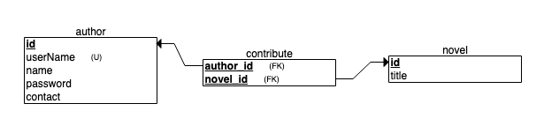

# CS3704 project

## Use Cases

1. click sign up button to create author
2. sign with username and password (admin, 123456)
3. click delete button to delete author 
4. click update button to update author's profile
5. click Add Novel button to add a novel to current author

## ER Diagram

## Relational Diagram

## How to open and edit

### Intellij IDEA:

1. Run the code: `git clone https://github.com/LMCNN/cs3704.git` to copy the code to your local machine.
2. Using Intellij IDEA to open the pom.xml file in the code directory as a project

#### Run the program with the terminal:

1. Go to the code directory
2. run: `./mvnw spring-boot:run`
3. Browser address: localhost:8080

*~~There are 21 unit tests inside the `/code/src/test/java/com/cs3704/novel` directory*~~

